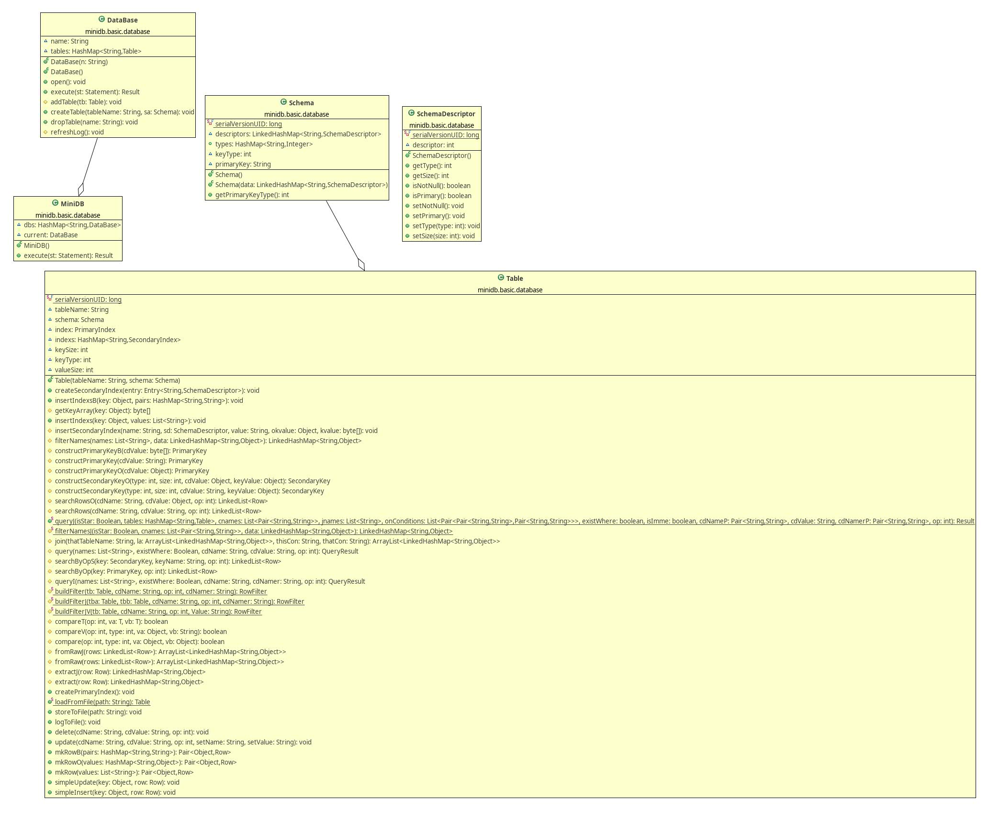

### MiniDB的元数据管理模块

[TOC]

**（注：此部分内容在 *存储管理模块* 文档中已经出现过）**

#### 元数据存储机制

##### 1. 基本原理
元数据主要利用Java类的序列化进行存储。Schema类中利用LinkedHashMap存储数据库表的schema信息，包括表项名，类型，约束等。执行create table操作时，会将创建的Schema类序列化后存储在单个文件中，并将该文件路径写入schema.log文件中，这样在打开数据库时，扫描schema.log文件中记录的文件，读取文件，反序列化并载入schema。

MiniBD.Java类 主要负责切换，创建，删除数据库实例，实现

- 创建数据库 CREATE DATABASE dbName

- 删除数据库 DROP DATABASE dbName

- 切换数据库 USE DATABASE dbName

- 查询所有数据库 SHOW DATABASES

- 查询一个数据库中所有表名 SHOW DATABASE dbName

##### 2. 具体实现

DataBase.Java类：数据库类，对数据库的实现，使用HashMap存储数据库表，封装了一些操作接口

Table.Java类：数据库表类，对数据库表的实现，存储表名，主键索引，次级索引，schema，主键类型等信息，封装了一系列数据库操作接口

Schema.Java类：存储表项名，类型，约束等信息，implement serializable用以实现持久化存储

SchemaDescriptor.Java类：使用一个int存储数据库attribute的类型，约束，大小的信息，利用位运算得到特定信息，封装了各种信息的get和set

MiniBD.Java类 主要负责切换，创建，删除数据库实例

##### 3. 主要类的类图

   