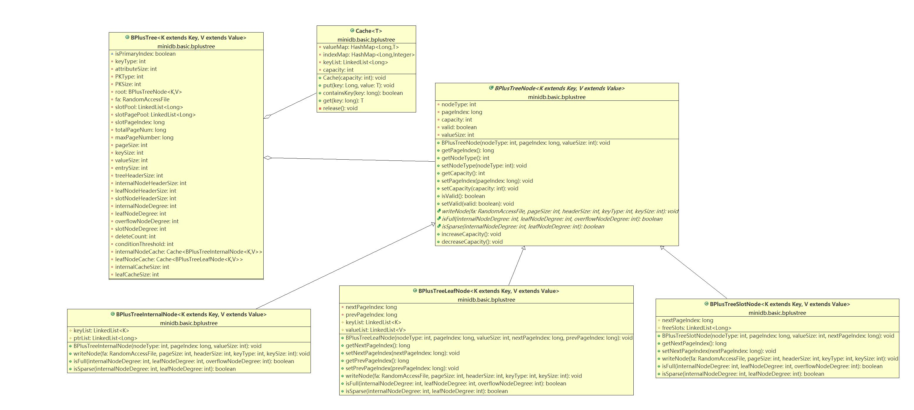
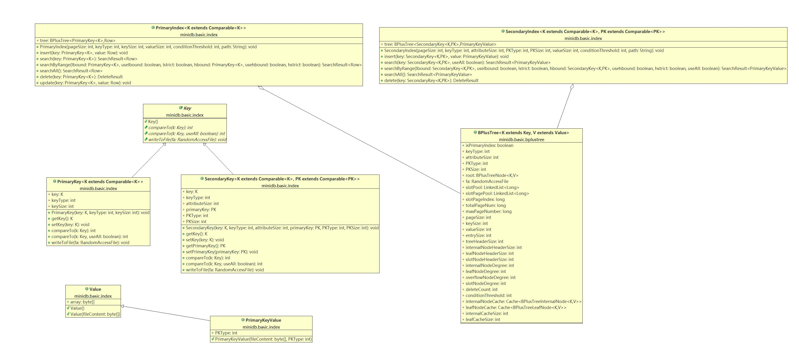

### MiniDB的存储模块

#### 数据的存储机制

##### 1. 基本原理

MiniDB采用**B+树**作为索引，所有数据直接存储在叶节点中。具体实现保证了各个数据的键值各不相同。每一个节点存储在一个**page**中。所有的page都存储在一个文件中，page的大小是一个预先指定好的值。为了避免存储浪费，使用**page pool**技术管理所有page，空闲的page被page pool维护，需要新page时直接取用。page pool的信息被储存到slot page中。

为了节省时间，MiniDB的B+树采用了缓存，对叶节点和内部节点分别维护了缓存。缓存采取了**LRU**的替换机制，采用**write- allocate**和**write-through**的读写策略。

##### 2. 具体实现

+ 1.解析下面列表中提到的SQL，并生成对应的执行计划。2.执行生成的计划，并返回对应结果。加分项：应用课程中介绍的查询优化技术。主键支持多列。Where条件支持andor。Select支持选择表达式。BPlusTree<K extends Key, V extends Value>类：B+树的实现类
+ BPlusTreeNode<K extends Key, V extends Value>类：节点的实现类
+ BPlusTreeLeafNode<K extends Key, V extends Value> 类：叶节点的实现类
+ BPlusTreeInternalNode<K extends Key, V extends Value>类：内部节点的实现类
+ BPlusTreeSlotNode<K extends Key, V extends Value>类：slot page的实现类
+ BPlusTreeConst类：维护了一些常量
+ BPlusTreeUtils类：B+树的一些通用操作
+ Cache\<T\>类：缓存的实现类

##### 3. 主要类的类图

#### 数据库的索引机制

##### 1. 基本原理

MiniDB支持建立在单个属性上的primary index和secondary index。在创建table时，数据库会为主键创建primary index，为每个非主键的属性创建一个secondary index。每个index都对应于一个B+树，primary index对应的B+树的key是主键值，value是tuple；secondary index对应的B+树的key是**属性值+主键值**，value是**主键值**，这样就保证了键值的唯一性。

##### 2. 具体实现

+ PrimaryIndex<K extends Comparable\<K\>>类：primary index的实现类
+ SecondaryIndex<K extends Comparable\<K\>, PK extends Comparable\<PK\>>类：secondary index的实现类
+ Key类：抽象类，对B+树的键值的封装
+ PrimaryKey<K extends Comparable\<K\>>类：primary index中对主键值的封装
+ SecondaryKey<K extends Comparable\<K\>, PK extends Comparable\<PK\>>类：secondary index中对**属性值+主键值**的封装
+ Value类：对B+树中存储的数据值的封装
+ Row类：primary index中对数据（元组）的实现，也是数据库中对内存和外存中元组的实现
+ PrimaryKeyValue类：secondary index中对数据（主键值）的实现

##### 3. 主要类的类图

#### 元数据存储机制
##### 1. 基本原理
元数据主要利用Java类的序列化进行存储。Schema类中利用LinkedHashMap存储数据库表的schema信息，包括表项名，类型，约束等。执行create table操作时，会将创建的Schema类序列化后存储在单个文件中，并将该文件路径写入schema.log文件中，这样在打开数据库时，扫描schema.log文件中记录的文件，读取文件，反序列化并载入schema。

MiniBD.Java类 主要负责切换，创建，删除数据库实例，实现

- 创建数据库 CREATE DATABASE dbName

- 删除数据库 DROP DATABASE dbName

- 切换数据库 USE  DATABASE dbName

- 查询所有数据库 SHOW DATABASES

- 查询一个数据库中所有表名 SHOW DATABASE dbName

##### 2. 具体实现

DataBase.Java类：数据库类，对数据库的实现，使用HashMap存储数据库表，封装了一些操作接口

Table.Java类：数据库表类，对数据库表的实现，存储表名，主键索引，次级索引，schema，主键类型等信息，封装了一系列数据库操作接口

Schema.Java类：存储表项名，类型，约束等信息，implement serializable用以实现持久化存储

SchemaDescriptor.Java类：使用一个int存储数据库attribute的类型，约束，大小的信息，利用位运算得到特定信息，封装了各种信息的get和set

MiniBD.Java类 主要负责切换，创建，删除数据库实例

##### 3. 主要类的类图

   